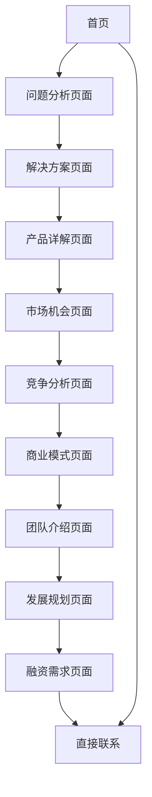

# Mulfin AI情绪伙伴 - 产品需求文档

## 1. 产品概述

Mulfin是一款面向投资人的产品介绍网站，展示可拥抱的AI情绪伙伴项目的商业价值和投资潜力。
- 核心目标：通过专业的网站展示向投资人全面介绍Mulfin项目，包括市场机会、技术优势、商业模式和融资需求。
- 目标用户：种子轮/天使轮投资人、风险投资机构、产业投资者。
- 市场价值：填补智能情感陪伴市场空白，抓住千亿级宠物经济和心理健康市场机遇。

## 2. 核心功能

### 2.1 用户角色

| 角色 | 访问方式 | 核心权限 |
|------|----------|----------|
| 投资人 | 直接访问网站 | 浏览所有内容、下载商业计划书、联系团队 |
| 潜在合作伙伴 | 直接访问网站 | 浏览产品信息、了解合作机会 |

### 2.2 功能模块

我们的投资人展示网站包含以下主要页面：
1. **首页**：项目封面、核心定位、导航菜单
2. **问题分析页面**：市场痛点展示、用户需求洞察
3. **解决方案页面**：产品愿景、核心价值主张
4. **产品详解页面**：硬件功能、软件生态、技术特色
5. **市场机会页面**：市场规模、目标用户、发展趋势
6. **竞争分析页面**：竞争格局、差异化优势
7. **商业模式页面**：收入模式、渠道策略
8. **团队介绍页面**：核心成员、团队优势
9. **发展规划页面**：里程碑、未来规划
10. **融资需求页面**：资金需求、用途分配
11. **联系页面**：联系方式、下载资料

### 2.3 页面详情

| 页面名称 | 模块名称 | 功能描述 |
|----------|----------|----------|
| 首页 | 英雄区域 | 展示项目名称Mulfin、核心定位"不止是玩具，更是懂你的AI情绪伙伴"、视觉冲击力强的产品概念图 |
| 首页 | 导航菜单 | 提供快速跳转到各个章节的锚点导航，支持平滑滚动效果 |
| 问题分析页面 | 痛点展示 | 通过数据可视化展示现代社会孤独感问题、三大核心痛点的详细分析 |
| 解决方案页面 | 产品展示 | 产品愿景介绍、核心价值主张、产品概念图或实物展示 |
| 产品详解页面 | 硬件功能 | 多模态交互、触感反馈、个性化成长引擎的技术说明 |
| 产品详解页面 | 软件生态 | 专属App、社区功能、增值服务的功能介绍 |
| 市场机会页面 | 市场分析 | 市场规模数据、目标用户画像、市场趋势分析 |
| 竞争分析页面 | 竞争格局 | 2x2竞争定位图、核心差异点对比分析 |
| 商业模式页面 | 收入模式 | 硬件销售、订阅服务、增值服务的商业模式说明 |
| 商业模式页面 | 渠道策略 | 线上线下渠道、合作伙伴策略 |
| 团队介绍页面 | 成员展示 | 核心团队成员头像、职位、背景介绍 |
| 发展规划页面 | 里程碑 | 已完成成果、未来12-18个月详细规划时间线 |
| 融资需求页面 | 资金需求 | 融资目标金额、资金用途饼图、投资回报预期 |
| 联系页面 | 联系方式 | 团队联系信息、商业计划书下载、投资咨询表单 |

## 3. 核心流程

**投资人浏览流程：**
投资人访问网站 → 首页了解项目概况 → 浏览问题分析了解市场需求 → 查看解决方案和产品详解 → 分析市场机会和竞争优势 → 了解商业模式和团队背景 → 查看发展规划和融资需求 → 通过联系页面获取更多信息或下载商业计划书

## 4. 用户界面设计

### 4.1 设计风格

- **主色调**：温暖橙色(#FF6B35)作为主色，深蓝色(#1E3A8A)作为辅助色，体现科技感与温暖感的结合
- **按钮样式**：圆角按钮设计，支持悬停动画效果，体现现代感
- **字体**：中文使用思源黑体，英文使用Inter字体，标题18-32px，正文14-16px
- **布局风格**：卡片式布局，顶部固定导航，支持锚点跳转和平滑滚动
- **图标风格**：线性图标风格，配合适当的动画效果增强交互体验

### 4.2 页面设计概览

| 页面名称 | 模块名称 | UI元素 |
|----------|----------|--------|
| 首页 | 英雄区域 | 全屏背景渐变(橙色到蓝色)、大标题动画、产品3D展示、CTA按钮 |
| 问题分析页面 | 痛点展示 | 数据可视化图表、图标+文字卡片布局、深色背景突出问题严重性 |
| 解决方案页面 | 产品展示 | 产品图片轮播、特性列表、视频演示区域 |
| 产品详解页面 | 功能介绍 | 标签页切换、功能演示动画、技术参数表格 |
| 市场机会页面 | 数据展示 | 市场规模饼图、用户画像卡片、趋势折线图 |
| 竞争分析页面 | 竞争对比 | 2x2象限图、产品对比表格、优势突出显示 |
| 商业模式页面 | 模式说明 | 收入流程图、渠道策略时间线、合作伙伴Logo墙 |
| 团队介绍页面 | 成员展示 | 团队成员卡片、技能标签、团队愿景大字展示 |
| 发展规划页面 | 时间线 | 垂直时间线设计、里程碑节点、进度条动画 |
| 融资需求页面 | 资金展示 | 融资目标大数字、资金用途饼图、ROI预测图表 |
| 联系页面 | 联系表单 | 简洁表单设计、下载按钮、社交媒体链接 |

### 4.3 响应式设计

网站采用移动优先的响应式设计，支持桌面端(1200px+)、平板端(768-1199px)和移动端(320-767px)的完美适配，确保投资人在任何设备上都能获得良好的浏览体验。