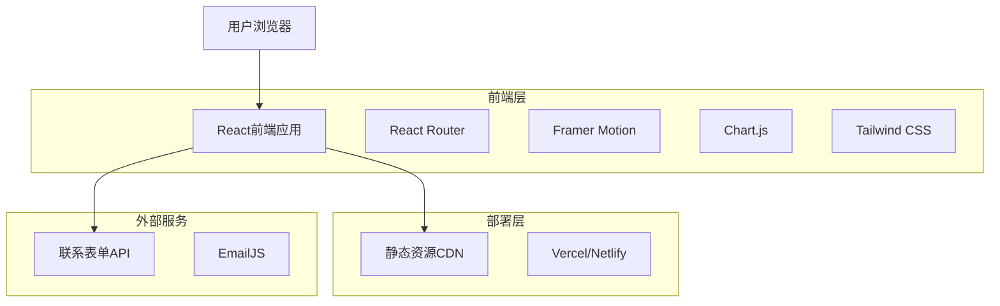
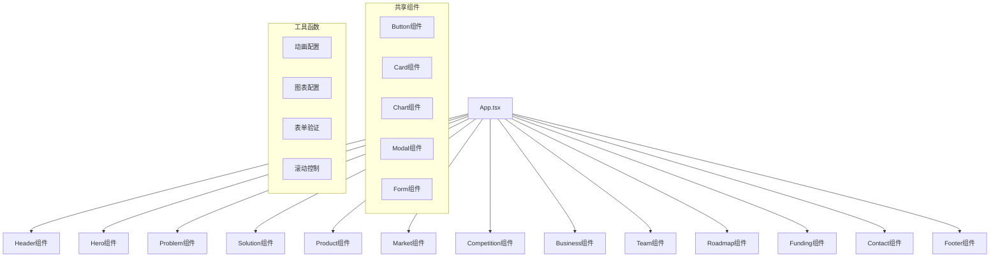

# Mulfin AI情绪伙伴 - 技术架构文档

## 1. 架构设计



## 2. 技术描述

* 前端：React\@18 + TypeScript\@5 + Vite\@5 + Tailwind CSS\@3 + Framer Motion\@10

* 图表库：Chart.js\@4 + React-Chartjs-2\@5

* 路由：React Router\@6

* 表单：React Hook Form\@7

* 邮件服务：EmailJS

* 部署：Vercel或Netlify静态部署

## 3. 路由定义

| 路由            | 目的             |
| ------------- | -------------- |
| /             | 首页，包含完整的单页应用内容 |
| /#hero        | 英雄区域锚点         |
| /#problem     | 问题分析区域锚点       |
| /#solution    | 解决方案区域锚点       |
| /#product     | 产品详解区域锚点       |
| /#market      | 市场机会区域锚点       |
| /#competition | 竞争分析区域锚点       |
| /#business    | 商业模式区域锚点       |
| /#team        | 团队介绍区域锚点       |
| /#roadmap     | 发展规划区域锚点       |
| /#funding     | 融资需求区域锚点       |
| /#contact     | 联系方式区域锚点       |

## 4. API定义

### 4.1 核心API

联系表单提交

```
POST /api/contact (通过EmailJS实现)
```

请求参数：

| 参数名称               | 参数类型   | 是否必需  | 描述    |
| ------------------ | ------ | ----- | ----- |
| name               | string | true  | 联系人姓名 |
| email              | string | true  | 联系人邮箱 |
| company            | string | false | 公司名称  |
| message            | string | true  | 留言内容  |
| investmentInterest | string | false | 投资意向  |

响应参数：

| 参数名称    | 参数类型    | 描述   |
| ------- | ------- | ---- |
| success | boolean | 提交状态 |
| message | string  | 响应消息 |

请求示例：

```json
{
  "name": "张投资",
  "email": "investor@example.com",
  "company": "某某投资基金",
  "message": "对Mulfin项目很感兴趣，希望了解更多详情",
  "investmentInterest": "种子轮"
}
```

## 5. 组件架构设计



## 6. 数据模型

### 6.1 数据模型定义

由于这是一个静态展示网站，主要使用本地数据配置，不需要数据库。主要数据结构包括：

```typescript
// 团队成员数据
interface TeamMember {
  id: string;
  name: string;
  position: string;
  avatar: string;
  bio: string;
  skills: string[];
}

// 竞争对手数据
interface Competitor {
  name: string;
  intelligence: number; // 1-10
  price: number; // 1-10
  description: string;
}

// 市场数据
interface MarketData {
  segment: string;
  size: number;
  growth: number;
  opportunity: string;
}

// 里程碑数据
interface Milestone {
  date: string;
  title: string;
  description: string;
  status: 'completed' | 'in-progress' | 'planned';
}

// 联系表单数据
interface ContactForm {
  name: string;
  email: string;
  company?: string;
  message: string;
  investmentInterest?: string;
}
```

### 6.2 配置文件结构

```
src/
├── data/
│   ├── teamData.ts          # 团队成员信息
│   ├── marketData.ts        # 市场数据
│   ├── competitorData.ts    # 竞争对手数据
│   ├── milestoneData.ts     # 里程碑数据
│   └── businessData.ts      # 商业模式数据
├── components/
│   ├── sections/            # 页面区域组件
│   ├── ui/                  # 通用UI组件
│   └── charts/              # 图表组件
├── hooks/                   # 自定义Hook
├── utils/                   # 工具函数
└── styles/                  # 样式文件
```

